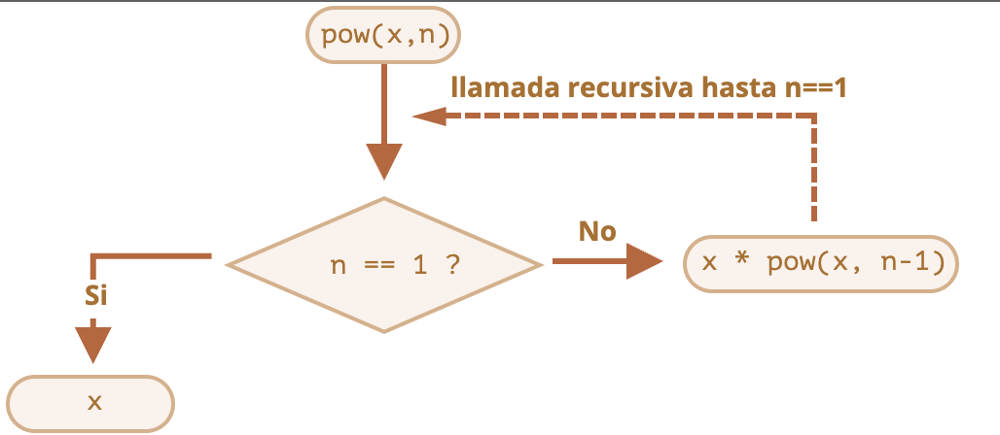
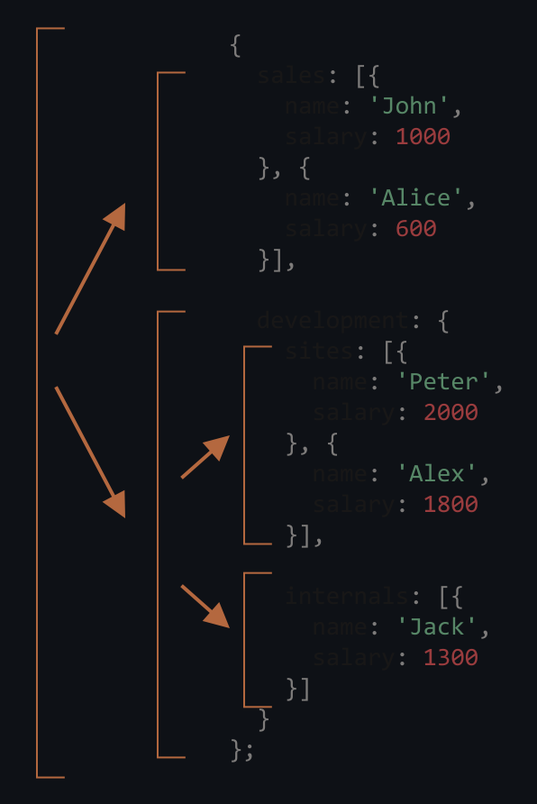
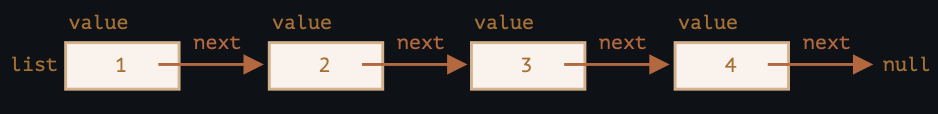
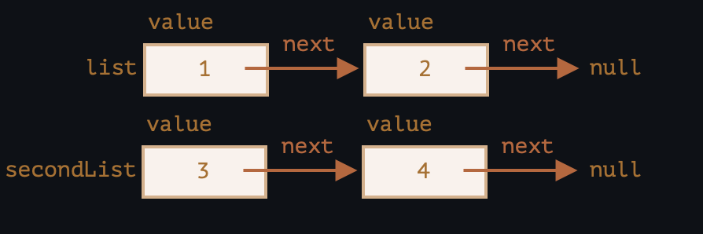
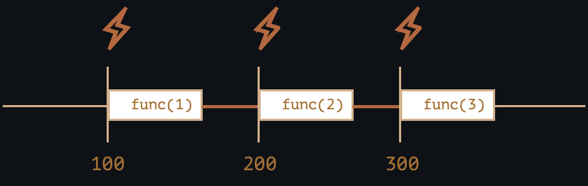

# Especiales JavaScript. 

Este repositorio resume brevemente las características de JavaScript que hemos aprendido hasta ahora, prestando especial atención a los detalles relevantes.

## Estructura de Código

Las declaraciones se delimitan con un punto y coma:

```javascript
alert('Hola'); alert('Mundo');
```

En general, un salto de línea también se trata como un delimitador, por lo que también funciona:

```javascript
alert('Hola') alert('Mundo')
```

Esto se llama “inserción automática de punto y coma”. A veces no funciona, por ejemplo:

```javascript
alert("Habrá un error después de este mensaje.")  [1, 2].forEach(alert)
```

La mayoría de las guías de estilo de código coinciden en que debemos poner un punto y coma después de cada declaración.

Los puntos y comas no son necesarios después de los bloques de código `{...}` y los constructores de sintaxis como los bucles:

```javascript
function f() {   // no se necesita punto y coma después de la declaración de función }  
for(;;) {   // no se necesita punto y coma después del bucle }`
```

…Pero incluso si colocásemos un punto y coma “extra” en alguna parte, eso no sería un error. Solo sería ignorado.


## Modo estricto

Para habilitar completamente todas las características de JavaScript moderno, debemos comenzar los scripts con `"use strict"`.

```javascript
'use strict';  ...
```

La directiva debe estar en la parte superior de un script o al comienzo de una función.

Sin la directiva `"use strict"` todo sigue funcionando, pero algunas características se comportan de la manera antigua y “compatible”. Generalmente preferimos el comportamiento moderno.

Algunas características modernas del lenguaje (como las clases que estudiaremos en el futuro) activan el modo estricto implícitamente.

## Variables

Se pueden declarar usando:

-   `let`
-   `const` (constante, no se puede cambiar)
-   `var` (estilo antiguo, lo veremos más tarde)

Un nombre de variable puede incluir:

-   Letras y dígitos, pero el primer carácter no puede ser un dígito.
-   Los caracteres `$` y `_` son normales, al igual que las letras.
-   Los alfabetos y jeroglíficos no latinos también están permitidos, pero comúnmente no se usan.

Las variables se escriben dinámicamente. Pueden almacenar cualquier valor:
```javascript
let x = 5; 
x = "John";
```
Hay 8 tipos de datos:

-   `number` tanto para números de punto flotante como enteros,
-   `bigint` para números enteros de largo arbitrario,
-   `string` para textos,
-   `boolean` para valores lógicos: `true/false`,
-   `null` – un tipo con el valor único `null`, que significa “vacío” o “no existe”,
-   `undefined` – un tipo con el valor único `undefined`, que significa “no asignado”,
-   `object` y `symbol` – para estructuras de datos complejas e identificadores únicos, aún no los hemos aprendido.

El operador `typeof` devuelve el tipo de un valor, con dos excepciones:

```javascript
typeof null == "object" // error del lenguaje
typeof function(){} == "function" // las funciones son tratadas especialmente`
```

## Interacción

Estamos utilizando un navegador como entorno de trabajo, por lo que las funciones básicas de la interfaz de usuario serán:

`prompt(question, [default])`

Hace una pregunta `question`, y devuelve lo que ingresó el visitante o `null` si presiona “cancelar”.

`confirm(question)`

Hace una pregunta `question`, y sugiere elegir entre Aceptar y Cancelar. La elección se devuelve como booleano `true/false`.

`alert(message)`

Muestra un `message`.

Todas estas funciones son _modales_, pausan la ejecución del código y evitan que el visitante interactúe con la página hasta que responda.

Por ejemplo:

```javascript
let userName = prompt("¿Su nombre?", "Alice"); 
let isTeaWanted = confirm("¿Quiere té?");  

alert( "Visitante: " + userName ); // Alice 
alert( "Quiere té: " + isTeaWanted ); // true
```


## Operadores

JavaScript soporta los siguientes operadores:

<b>Aritméticos</b>

Los normales: `* + - /`, también `%` para los restos y `**` para aplicar potencia de un número.

El binario más `+` concatena textos. Si uno de los operandos es un texto, el otro también se convierte en texto:
```javascript
alert( '1' + 2 ); // '12', texto 
alert( 1 + '2' ); // '12', texto
```


<b>Asignaciones</b>

Existen las asignaciones simples: `a = b` y las combinadas `a *= 2`.

Operador bit a bit

Los operadores bit a bit funcionan con enteros de 32 bits al más bajo nivel.

<b>Condicional</b>

El único operador con 3 parámetros: `cond ? resultA : resultB`. Sí `cond` es verdadera, devuelve `resultA`, de lo contrario `resultB`.

<b>Operadores Lógicos</b>

Los operadores lógicos Y `&&` y Ó `||` realizan una evaluación de circuito corto y luego devuelven el valor donde se detuvo (no necesariamente true/false). El operador lógico NOT `!` convierte el operando a tipo booleano y devuelve el valor inverso.

<b>Operador “Nullish coalescing”</b>

El operador `??` brinda una forma de elegir el primer valor “definido” de una lista de variables. El resultado de `a ?? b` es `a` salvo que esta sea `null/undefined`, en cuyo caso será `b`.

<b>Comparaciones</b>

Para verificar la igualdad `==` de valores de diferentes tipos, estos se convierten a número (excepto `null` y `undefined` que son iguales entre sí y nada más), por lo que son iguales:
```javascript
alert( 0 == false ); // true alert( 0 == '' ); // true
```

Otras comparaciones también se convierten en un número.

El operador de igualdad estricta `===` no realiza la conversión: diferentes tipos siempre significan diferentes valores.

Los valores `null` y `undefined` son especiales: son iguales `==` el uno al otro y no son iguales a nada más.

Las comparaciones mayor/menor comparan las cadenas carácter por carácter, los demás tipos de datos se convierten a número.

<b>Otros operadores</b>

Hay algunos otros, como un operador de coma.


## Bucles

-   Cubrimos 3 tipos de bucles:
    ```javascript
    // 1 
    while (condition) {   
		... 
		}  
    // 2 
    do { 
      ... 
      } while (condition);  
    // 3 
    for(let i = 0; i < 10; i++) {
       ... 
       }
    ```
    
-   La variable declarada en el bucle `for(let...)` sólo es visible dentro del bucle. Pero también podemos omitir el `let` y reutilizar una variable existente.
    
-   Directivas `break/continue` permiten salir de todo el ciclo/iteración actual. Use etiquetas para romper bucles anidados.


Más adelante estudiaremos más tipos de bucles para tratar con objetos.

## La construcción “switch”

La construcción “switch” puede reemplazar múltiples revisiones con `if`. “switch” utiliza `===` (comparación estricta).
```javascript
let age = prompt('¿Su Edad?', 18);

switch (age) {   
	case 18:      

		alert("No funciona");// el resultado de la petición es un string, no un número    
	case "18":     

		alert("¡Funciona!");
		break;

	default:
		alert("Todo valor que no sea igual a uno de arriba"); 
}
```


## Funciones

Cubrimos tres formas de crear una función en JavaScript:

1.  Declaración de función: la función en el flujo del código principal
    ```javascript
    function sum(a, b) {
       let result = a + b;
       
	    return result;
    }
    ```
    
2.  Expresión de función: la función en el contexto de una expresión
    ```javascript
    let sum = function(a, b) {   
	    let result = a + b;    
	    
	    return result;
	};
    ```
    
3.  Funciones de flecha:
    ```javascript
    // la expresión en el lado derecho 
    let sum = (a, b) => a + b;  
    
    // o sintaxis multilínea { ... }, aquí necesita return: 
    let sum = (a, b) => { 
      // ...  
     return a + b;
    } 
    
    // sin argumentos
     let sayHi = () => alert("Hello");
     
	// con un único argumento 
	let double = n => n * 2;
    ```
    

-   Las funciones pueden tener variables locales: son aquellas declaradas dentro de su cuerpo. Estas variables solo son visibles dentro de la función.
-   Los parámetros pueden tener valores predeterminados: `function sum(a = 1, b = 2) {...}`
-   Las funciones siempre devuelven algo. Si no hay `return`, entonces el resultado es `undefined`.

# La sentencia "switch"

Una sentencia `switch` puede reemplazar múltiples condiciones `if`.

Provee una mejor manera de comparar un valor con múltiples variantes.

## La sintaxis

`switch` tiene uno o mas bloques `case`y un opcional `default`.

Se ve de esta forma:
```javascript
switch(x) {   
	case 'valor1':  // if (x === 'valor1') 
	  ---
		[break] 
		   
	case 'valor2':  /* if (x === 'valor2')*/
	  ---    
		[break]   
		
	default:     
	  ---     
		[break] 
}
```

-   El valor de `x` es comparado contra el valor del primer `case` (en este caso, `valor1`), luego contra el segundo (`valor2`) y así sucesivamente, todo esto bajo una igualdad estricta.
-   Si la igualdad es encontrada, `switch` empieza a ejecutar el código iniciando por el primer `case`correspondiente, hasta el `break` más cercano (o hasta el final del `switch`).
-   Si no se cumple ningún caso entonces el código `default` es ejecutado (si existe).

## Ejemplo

Un ejemplo de `switch`:
```javascript
let a = 2 + 2;

switch (a) {
	case 3:
     	 alert( 'Muy pequeño' );
     	 break;  
	 
    	case 4:     
	 alert( '¡Exacto!' );     
	 break;  
	 
	case 5:     
	 alert( 'Muy grande' );     
	 break;  
	 
	default:     
	 alert( "Desconozco estos valores" ); 
}
```

Aquí el `switch` inicia comparando `a` con la primera variante `case` que es `3`. La comparación falla.

Luego `4`. La comparación es exitosa, por tanto la ejecución empieza desde `case 4` hasta el `break` más cercano.

**Si no existe `break` entonces la ejecución continúa con el próximo `case` sin ninguna revisión.**

Un ejemplo sin `break`:

```javascript
let a = 2 + 2;  

switch (a) {  
	case 3:     
	 alert( 'Muy pequeño' );   
	case 4:     
	 alert( '¡Exacto!' );   
	case 5:     
	 alert( 'Muy grande' );   
	default:     
alert( "Desconozco estos valores" );
}
```


En el ejemplo anterior veremos ejecuciones de tres `alert` secuenciales:
```javascript
alert( '¡Exacto!' );
alert( 'Muy grande' );
alert( "Desconozco estos valores" );
```

Cualquier expresión puede ser un argumento `switch/case`

Ambos `switch` y `case` permiten expresiones arbitrarias.

Por ejemplo:

```javascript
let a = "1";
let b = 0;
switch (+a) {
	case b + 1:
	 alert("esto se ejecuta, porque +a es 1, exactamente igual b+1"); 
	 break;
	 
	default: 
	 alert("esto no se ejecuta"); }
```

Aquí `+a` da `1`, esto es comparado con `b + 1` en `case`, y el código correspondiente es ejecutado.

## Agrupamiento de “case”

Varias variantes de `case` los cuales comparten el mismo código pueden ser agrupadas.

Por ejemplo, si queremos que se ejecute el mismo código para `case 3` y `case 5`:
```javascript
let a = 2 + 2;  

switch (a) {   
	case 4:     
	 alert('¡Correcto!');     
break; 

	case 3:                    // (*) agrupando dos cases   
	case 5:     
	 alert('¡Incorrecto!');     
	 alert("¿Por qué no tomas una clase de matemáticas?");     
	 break;

	default:     
	 alert('El resultado es extraño. Realmente.'); }
```

Ahora ambos, `3` y `5`, muestran el mismo mensaje.

La capacidad de “agrupar” los `case` es un efecto secundario de cómo trabaja `switch/case` sin `break`. Aquí la ejecución de `case 3` inicia desde la línea `(*)` y continúa a través de `case 5`, porque no existe `break`.

## El tipo importa

Vamos a enfatizar que la comparación de igualdad es siempre estricta. Los valores deben ser del mismo tipo para coincidir.

Por ejemplo, consideremos el código:
```javascript
let arg = prompt("Ingrese un valor");
switch (arg) {
	case '0':   
	case '1':     
	 alert( 'Uno o cero' );     
	 break; 
	    
	case '2':     
	 alert( 'Dos' );     
	 break;
	     
	case 3:      
	 alert( '¡Nunca ejecuta!' );     
	 break;   
	default:     
	 alert( 'Un valor desconocido' ); }
```

1.  Para `0`, `1`, se ejecuta el primer `alert`.
2.  Para `2` se ejecuta el segundo `alert`.
3.  Pero para `3`, el resultado del `prompt` es un string `"3"`, el cual no es estrictamente igual `===` al número `3`. Por tanto ¡Tenemos un código muerto en `case 3`! La variante `default` se ejecutará.

## Ejercicios

### Reescribe el "switch" en un "if
Escribe el código utilizando `if..else` que corresponda al siguiente `switch`:
```javascript
switch (navegador) {
	case 'Edge':
	 alert( "¡Tienes Edge!" );
	 break; 

	case 'Chrome': 
	case 'Firefox': 
	case 'Safari': 
	case 'Opera': 
	 alert( 'Esta bien, soportamos estos navegadores también' ); 
	 break;

	default: 
alert( '¡Esperamos que esta página se vea bien!' );
}
```

<details><summary>Respuesta - ¡Haz Click!</summary>

Para que coincida con la funcionalidad de `switch` exactamente, el `if` debe utilizar una comparación estricta `'==='`.

Pero para strings, un simple `'=='` también funciona.
```javascript

if(navegador == 'Edge') {
	alert("¡Tienes Edge!"); 
} else if (navegador == 'Chrome'
	|| navegador == 'Firefox'  
	|| navegador == 'Safari'  
	|| navegador == 'Opera') { 
	  alert( 'Está bien, soportamos estos navegadores también' );
 } else {  
	  alert( '¡Esperamos que la página se vea bien!' );
 }
```
Nota: la construcción `navegador == 'Chrome' || navegador == 'Firefox' …` fue separada en varias líneas para mejorar su lectura.

Pero la construcción `switch` sigue siendo más clara y descriptiva.

</details>


### Reescribe "if" en "switch
Reescribe el código debajo utilizando solo un argumento `switch`:

```javascript
let a = +prompt('a?', '');

if (a == 0) { 
	alert( 0 );
} 

if (a == 1) {
	alert( 1 );
} 

if (a == 2 || a == 3) {
	alert( '2,3' );
}
```

<details><summary>Respuesta - ¡Haz Click!</summary>

Las primeras dos validaciones se vuelven dos `case`. La tercera validación se separa en dos `case`:

```javascript
let a = +prompt('a?', '');

switch (a) {
	case 0: 
	 alert( 0 );
	 break;

	case 1: 
	 alert( 1 ); 
	 break;

	case 2:
	case 3:
	 alert( '2,3' );
	 break;
}
```

Nota: El `break` al final no es requerido. Pero lo agregamos por previsión, para preparar el código para el futuro.

Existe una probabilidad de que en el futuro queramos agregar un `case` adicional, por ejemplo `case 4`. Y si olvidamos agregar un break antes, al final de `case 3`, habrá un error. Por tanto, es una forma de auto-asegurarse.

</details>


# Recursión y pila

Volvamos a las funciones y estudiémoslas más en profundidad.

Nuestro primer tema será la *recursividad*.

Si no eres nuevo en la programación, probablemente te resulte familiar y puedes saltarte este capítulo.

La recursión es un patrón de programación que es útil en situaciones en las que una tarea puede dividirse naturalmente en varias tareas del mismo tipo, pero más simples. O cuando una tarea se puede simplificar en una acción fácil más una variante más simple de la misma tarea. O, como veremos pronto, tratar con ciertas estructuras de datos.

Sabemos que cuando una función resuelve una tarea, en el proceso puede llamar a muchas otras funciones. Un caso particular de esto se da cuando una función *se llama a sí misma*. Esto es lo que se llama *recursividad*.

## Dos formas de pensar

Para comenzar con algo simple, escribamos una función `pow(x, n)` que eleve `x` a una potencia natural de`n`. En otras palabras, multiplica `x` por sí mismo `n` veces.

```js
pow(2, 2) = 4
pow(2, 3) = 8
pow(2, 4) = 16
```

Hay dos formas de implementarlo.

1. Pensamiento iterativo: el bucle `for`:

    ```js run
    function pow(x, n) {
      let result = 1;

      // multiplicar el resultado por x n veces en el ciclo
      for (let i = 0; i < n; i++) {
        result *= x;
      }

      return result;
    }

    alert( pow(2, 3) ); // 8
    ```

2. Pensamiento recursivo: simplifica la tarea y se llama a sí mismo:

    ```js run
    function pow(x, n) {
      if (n == 1) {
        return x;
      } else {
        return x * pow(x, n - 1);
      }
    }

    alert( pow(2, 3) ); // 8
    ```

Note cómo la variante recursiva es fundamentalmente diferente.

Cuando se llama a `pow(x, n)`, la ejecución se divide en dos ramas:

```js
              if n==1  = x
             /
pow(x, n) =
             \
              else     = x * pow(x, n - 1)
```

1. Si `n == 1`, entonces todo es trivial. Esto se llama *base* de la recursividad, porque produce inmediatamente el resultado obvio: `pow (x, 1)` es igual a `x`.
2. De lo contrario, podemos representar `pow (x, n)` como `x * pow (x, n - 1)`. En matemáticas, uno escribiría <code>x<sup>n</sup> = x * x <sup>n-1</sup></code>. Esto se llama *paso recursivo*: transformamos la tarea en una acción más simple (multiplicación por `x`) y una llamada más simple de la misma tarea (`pow` con menor `n`). Los siguientes pasos lo simplifican más y más hasta que `n` llegue a` 1`.

También podemos decir que `pow` *se llama a sí mismo recursivamente* hasta que` n == 1`.





Por ejemplo, para calcular `pow (2, 4)` la variante recursiva realiza estos pasos:

1. `pow(2, 4) = 2 * pow(2, 3)`
2. `pow(2, 3) = 2 * pow(2, 2)`
3. `pow(2, 2) = 2 * pow(2, 1)`
4. `pow(2, 1) = 2`

Por lo tanto, la recursión reduce una llamada de función a una más simple y luego... a una más simple, y así sucesivamente, hasta que el resultado se vuelve obvio.

Una solución recursiva suele ser más corta que una iterativa.

Aquí podemos reescribir lo mismo usando el operador condicional `?` En lugar de `if` para hacer que `pow (x, n)` sea más conciso y aún bastante legible:

```js run
function pow (x, n) {
   return (n == 1)? x: (x * pow (x, n - 1));
}
```

El número máximo de llamadas anidadas (incluida la primera) se llama *profundidad de recursión*. En nuestro caso, será exactamente `n`.

La profundidad máxima de recursión está limitada por el motor de JavaScript. Podemos confiar en que sea 10 000; algunos motores permiten más, pero 100 000 probablemente esté fuera del límite para la mayoría de ellos. Hay optimizaciones automáticas que ayudan a aliviar esto ("optimizaciones de llamadas de cola"), pero aún no tienen soporte en todas partes y funcionan solo en casos simples.

Eso limita la aplicación de la recursividad, pero sigue siendo muy amplia. Hay muchas tareas donde la forma recursiva de pensar proporciona un código más simple y fácil de mantener.

## El contexto de ejecución y pila

Ahora examinemos cómo funcionan las llamadas recursivas. Para eso espiemos lo que sucede bajo la capa en las funciones.

La información sobre el proceso de ejecución de una función en ejecución se almacena en su *contexto de ejecución*.

El contexto de ejecución es una estructura de datos interna que contiene detalles sobre la ejecución de una función: dónde está el flujo de control ahora, las variables actuales, el valor de `this` (que no usamos aquí) y algunos otros detalles internos.

Una llamada de función tiene exactamente un contexto de ejecución asociado.

Cuando una función realiza una llamada anidada, sucede lo siguiente:

- La función actual se pausa.
- El contexto de ejecución asociado con él se recuerda en una estructura de datos especial llamada *pila de contexto de ejecución*.
- La llamada anidada se ejecuta.
- Una vez que finaliza, el antiguo contexto de ejecución se recupera de la pila y la función externa se reanuda desde donde se pausó.

Veamos qué sucede durante la llamada de `pow (2, 3)`.

### pow (2, 3)

Al comienzo de la llamada `pow (2, 3)` el contexto de ejecución almacenará variables: `x = 2, n = 3`, el flujo de ejecución está en la línea `1` de la función.

Podemos esbozarlo como:

<ul class="function-execution-context-list">
  <li>
    <span class="function-execution-context">Context: { x: 2, n: 3, at line 1 }</span>
    <span class="function-execution-context-call">pow(2, 3)</span>
  </li>
</ul>

Ahí es cuando la función comienza a ejecutarse. La condición `n == 1` es falsa, por lo que el flujo continúa en la segunda rama de `if`:

```js run
function pow(x, n) {
  if (n == 1) {
    return x;
  } else {
*!*
    return x * pow(x, n - 1);
*/!*
  }
}

alert( pow(2, 3) );
```


Las variables son las mismas, pero la línea cambia, por lo que el contexto es ahora:

<ul class="function-execution-context-list">
  <li>
    <span class="function-execution-context">Context: { x: 2, n: 3, at line 5 }</span>
    <span class="function-execution-context-call">pow(2, 3)</span>
  </li>
</ul>

Para calcular `x * pow (x, n - 1)`, necesitamos hacer una sub-llamada de `pow` con nuevos argumentos` pow (2, 2) `.

### pow (2, 2)

Para hacer una llamada anidada, JavaScript recuerda el contexto de ejecución actual en la *pila de contexto de ejecución*.

Aquí llamamos a la misma función `pow`, pero no importa en absoluto. El proceso es el mismo para todas las funciones:

1. El contexto actual se "recuerda" en la parte superior de la pila.
2. El nuevo contexto se crea para la subllamada.
3. Cuando finaliza la subllamada, el contexto anterior se extrae de la pila y su ejecución continúa.

Aquí está la pila de contexto cuando ingresamos la subllamada `pow (2, 2)`:

<ul class="function-execution-context-list">
  <li>
    <span class="function-execution-context">Context: { x: 2, n: 2, at line 1 }</span>
    <span class="function-execution-context-call">pow(2, 2)</span>
  </li>
  <li>
    <span class="function-execution-context">Context: { x: 2, n: 3, at line 5 }</span>
    <span class="function-execution-context-call">pow(2, 3)</span>
  </li>
</ul>

El nuevo contexto de ejecución actual está en la parte superior (y en negrita), y los contextos recordados anteriores están debajo.

Cuando terminamos la subllamada: es fácil reanudar el contexto anterior, ya que mantiene ambas variables y el lugar exacto del código donde se detuvo.

```smart
En la figura usamos la palabra línea "line" porque en nuestro ejemplo hay solo una subllamada en línea, pero generalmente una simple línea de código puede contener múltiples subllamadas, como `pow(…) + pow(…) + otraCosa(…)`.

Entonces sería más preciso decir que la ejecución se reanuda "inmediatamente después de la subllamada".
```

### pow(2, 1)

El proceso se repite: se realiza una nueva subllamada en la línea `5`, ahora con argumentos` x = 2`, `n = 1`.

Se crea un nuevo contexto de ejecución, el anterior se coloca en la parte superior de la pila:

<ul class="function-execution-context-list">
  <li>
    <span class="function-execution-context">Context: { x: 2, n: 1, at line 1 }</span>
    <span class="function-execution-context-call">pow(2, 1)</span>
  </li>
  <li>
    <span class="function-execution-context">Context: { x: 2, n: 2, at line 5 }</span>
    <span class="function-execution-context-call">pow(2, 2)</span>
  </li>
  <li>
    <span class="function-execution-context">Context: { x: 2, n: 3, at line 5 }</span>
    <span class="function-execution-context-call">pow(2, 3)</span>
  </li>
</ul>

Hay 2 contextos antiguos ahora y 1 actualmente en ejecución para `pow (2, 1)`.

### La salida

Durante la ejecución de `pow (2, 1)`, a diferencia de antes, la condición `n == 1` es verdadera, por lo que funciona la primera rama de `if` :

```js
function pow(x, n) {
  if (n == 1) {
*!*
    return x;
*/!*
  } else {
    return x * pow(x, n - 1);
  }
}
```

No hay más llamadas anidadas, por lo que la función finaliza y devuelve `2`.

Cuando finaliza la función, su contexto de ejecución ya no es necesario y se elimina de la memoria. El anterior se restaura desde la parte superior de la pila:


<ul class="function-execution-context-list">
  <li>
    <span class="function-execution-context">Context: { x: 2, n: 2, at line 5 }</span>
    <span class="function-execution-context-call">pow(2, 2)</span>
  </li>
  <li>
    <span class="function-execution-context">Context: { x: 2, n: 3, at line 5 }</span>
    <span class="function-execution-context-call">pow(2, 3)</span>
  </li>
</ul>

Se reanuda la ejecución de `pow (2, 2)`. Tiene el resultado de la subllamada `pow (2, 1)`, por lo que también puede finalizar la evaluación de `x * pow (x, n - 1)`, devolviendo `4`.

Luego se restaura el contexto anterior:

<ul class="function-execution-context-list">
  <li>
    <span class="function-execution-context">Context: { x: 2, n: 3, at line 5 }</span>
    <span class="function-execution-context-call">pow(2, 3)</span>
  </li>
</ul>

Cuando termina, tenemos un resultado de `pow (2, 3) = 8`.

La profundidad de recursión en este caso fue: **3**.

Como podemos ver en las ilustraciones anteriores, la profundidad de recursión es igual al número máximo de contexto en la pila.

Tenga en cuenta los requisitos de memoria. Los contextos toman memoria. En nuestro caso, elevar a la potencia de `n` realmente requiere la memoria para `n` contextos, para todos los valores más bajos de `n`.

Un algoritmo basado en bucles ahorra más memoria:

```js
function pow(x, n) {
  let result = 1;

  for (let i = 0; i < n; i++) {
    result *= x;
  }

  return result;
}
```

El `pow` iterativo utiliza un solo contexto, cambiando `i` y `result` en el proceso. Sus requisitos de memoria son pequeños, fijos y no dependen de `n`.

**Cualquier recursión puede reescribirse como un bucle. La variante de bucle generalmente se puede hacer más eficaz.**

... Pero a veces la reescritura no es trivial, especialmente cuando la función utiliza sub-llamadas recursivas diferentes según las condiciones y combina sus resultados, o cuando la ramificación es más intrincada. Y la optimización podría ser innecesaria y no merecer la pena el esfuerzo en absoluto.

La recursión puede dar un código más corto y fácil de entender y mantener. No se requiere optimización en todo lugar, principalmente lo que nos interesa es un buen código y por eso se usa.

## Recorridos recursivos

Otra gran aplicación de la recursión es un recorrido recursivo.

Imagina que tenemos una empresa. La estructura del personal se puede presentar como un objeto:

```js
let company = {
  sales: [{
    name: 'John',
    salary: 1000
  }, {
    name: 'Alice',
    salary: 1600
  }],

  development: {
    sites: [{
      name: 'Peter',
      salary: 2000
    }, {
      name: 'Alex',
      salary: 1800
    }],

    internals: [{
      name: 'Jack',
      salary: 1300
    }]
  }
};
```

Vemos que esta empresa tiene departamentos.

- Un departamento puede tener una gran variedad de personal. Por ejemplo, el departamento de ventas `sales` tiene 2 empleados: John y Alice.
- O un departamento puede dividirse en subdepartamentos, como `development` que tiene dos ramas: `sites` e `internals`: cada uno de ellos tiene su propio personal.
- También es posible que cuando un subdepartamento crece, se divida en subdepartamentos (o equipos).

    Por ejemplo, el departamento `sites` en el futuro puede dividirse en equipos para `siteA` y `siteB`. Y ellos, potencialmente, pueden dividirse aún más. Eso no está en la imagen, es solo algo a tener en cuenta.

Ahora digamos que queremos una función para obtener la suma de todos los salarios. ¿Cómo podemos hacer eso?

Un enfoque iterativo no es fácil, porque la estructura no es simple. La primera idea puede ser hacer un bucle `for` sobre `company` con un sub-bucle anidado sobre departamentos de primer nivel. Pero luego necesitamos más sub-bucles anidados para iterar sobre el personal en los departamentos de segundo nivel como `sites`. ...¿Y luego otro sub-bucle dentro de los de los departamentos de tercer nivel que podrían aparecer en el futuro? ¿Deberíamos parar en el nivel 3 o hacer 4 niveles de bucles? Si ponemos 3-4 bucles anidados en el código para atravesar un solo objeto, se vuelve bastante feo.

Probemos la recursividad.

Como podemos ver, cuando nuestra función hace que un departamento sume, hay dos casos posibles:

1. O bien es un departamento "simple" con una *array* de personas: entonces podemos sumar los salarios en un bucle simple.
2. O es *un objeto* con `N` subdepartamentos: entonces podemos hacer `N` llamadas recursivas para obtener la suma de cada uno de los subdepartamentos y combinar los resultados.

El primer caso es la *base* de la recursividad, el caso trivial, cuando obtenemos un array.

El segundo caso, cuando obtenemos un objeto, es el paso recursivo. Una tarea compleja se divide en subtareas para departamentos más pequeños. A su vez, pueden dividirse nuevamente, pero tarde o temprano la división terminará en (1).

El algoritmo es probablemente aún más fácil de leer desde el código:


```js run
let company = { // el mismo objeto, comprimido por brevedad
  sales: [{name: 'John', salary: 1000}, {name: 'Alice', salary: 600 }],
  development: {
    sites: [{name: 'Peter', salary: 2000}, {name: 'Alex', salary: 1800 }],
    internals: [{name: 'Jack', salary: 1300}]
  }
};

// La función para hacer el trabajo
*!*
function sumSalaries(department) {
  if (Array.isArray(department)) { // caso (1)
    return department.reduce((prev, current) => prev + current.salary, 0); // suma del Array
  } else { // caso (2)
    let sum = 0;
    for (let subdep of Object.values(department)) {
      sum += sumSalaries(subdep); // llama recursivamente a subdepartamentos, suma los resultados
    }
    return sum;
  }
}
*/!*

alert(sumSalaries(company)); // 7700
```

El código es corto y fácil de entender (¿Quizás?). Ese es el poder de la recursividad. También funciona para cualquier nivel de anidamiento de subdepartamentos.

Aquí está el diagrama de llamadas:


Podemos ver fácilmente el principio: para un objeto `{...}` se realizan subllamadas, mientras que los Arrays `[...]` son las "hojas" del árbol recursivo y dan un resultado inmediato.

Tenga en cuenta que el código utiliza funciones inteligentes que hemos cubierto antes:

- Método `arr.reduce` para obtener la suma del Array.
- Bucle `for (val of Object.values (obj))` para iterar sobre los valores del objeto: `Object.values` devuelve una matriz de ellos.


## Estructuras recursivas

Una estructura de datos recursiva (definida recursivamente) es una estructura que se replica en partes.

Lo acabamos de ver en el ejemplo de la estructura de la empresa anterior.

Un *departamento* de la empresa es:
- O un array de personas.
- O un objeto con *departamentos*.

Para los desarrolladores web hay ejemplos mucho más conocidos: documentos HTML y XML.

En el documento HTML, una *etiqueta HTML* puede contener una lista de:
- Piezas de texto.
- Comentarios HTML.
- Otras *etiquetas HTML* (que a su vez pueden contener textos/comentarios, otras etiquetas, etc...).

Esa es, una vez más, una definición recursiva.

Para una mejor comprensión, cubriremos una estructura recursiva más llamada "Lista enlazada" que podría ser una mejor alternativa para las matrices en algunos casos.

### Lista enlazada

Imagina que queremos almacenar una lista ordenada de objetos.

La elección natural sería un array:

```js
let arr = [obj1, obj2, obj3];
```

...Pero hay un problema con los Arrays. Las operaciones "eliminar elemento" e "insertar elemento" son costosas. Por ejemplo, la operación `arr.unshift(obj)` debe renumerar todos los elementos para dejar espacio para un nuevo `obj`, y si la matriz es grande, lleva tiempo. Lo mismo con `arr.shift ()`.

Las únicas modificaciones estructurales que no requieren renumeración masiva son aquellas que operan con el final del array: `arr.push/pop`. Por lo tanto, un array puede ser bastante lento para grandes colas si tenemos que trabajar con el principio del mismo.

Como alternativa, si realmente necesitamos una inserción/eliminación rápida, podemos elegir otra estructura de datos llamada lista enlazada.

El *elemento de lista enlazada* se define de forma recursiva como un objeto con:
- `value`.
- propiedad `next` que hace referencia al siguiente *elemento de lista enlazado* o `null` si ese es el final.

Por ejemplo:

```js
let list = {
  value: 1,
  next: {
    value: 2,
    next: {
      value: 3,
      next: {
        value: 4,
        next: null
      }
    }
  }
};
```

Representación gráfica de la lista:



Un código alternativo para la creación:

```js no-beautify
let list = { value: 1 };
list.next = { value: 2 };
list.next.next = { value: 3 };
list.next.next.next = { value: 4 };
list.next.next.next.next = null;
```

Aquí podemos ver aún más claramente que hay varios objetos, cada uno tiene su `value` y un `next` apuntando al vecino. La variable `list` es el primer objeto en la cadena, por lo que siguiendo los punteros` next` de ella podemos alcanzar cualquier elemento.

La lista se puede dividir fácilmente en varias partes y luego volver a unir:

```js
let secondList = list.next.next;
list.next.next = null;
```



Para unir:

```js
list.next.next = secondList;
```

Y seguro, podemos insertar o eliminar elementos en cualquier lugar.

Por ejemplo, para anteponer un nuevo valor, necesitamos actualizar el encabezado de la lista:

```js
let list = { value: 1 };
list.next = { value: 2 };
list.next.next = { value: 3 };
list.next.next.next = { value: 4 };

*!*
// anteponer el nuevo valor a la lista
list = { value: "new item", next: list };
*/!*
```


Para eliminar un valor del medio, cambie el `next` del anterior:

```js
list.next = list.next.next;
```


Hicimos que `list.next` salte sobre `1` al valor `2`. El valor `1` ahora está excluido de la cadena. Si no se almacena en ningún otro lugar, se eliminará automáticamente de la memoria.

A diferencia de los arrays, no hay renumeración en masa, podemos reorganizar fácilmente los elementos.

Naturalmente, las listas no siempre son mejores que los Arrays. De lo contrario, todos usarían solo listas.

El principal inconveniente es que no podemos acceder fácilmente a un elemento por su número. En un Array eso es fácil: `arr[n]` es una referencia directa. Pero en la lista tenemos que comenzar desde el primer elemento e ir `siguiente` `N` veces para obtener el enésimo elemento.

... Pero no siempre necesitamos tales operaciones. Por ejemplo, cuando necesitamos una cola o incluso un [deque](https://es.wikipedia.org/wiki/Cola_doblemente_terminada): la estructura ordenada que debe permitir agregar/eliminar elementos muy rápidamente desde ambos extremos.

Las "listas" pueden ser mejoradas:
- Podemos agregar la propiedad `prev` (previo) junto a `next` (siguiente) para referenciar el elemento previo para mover hacia atrás fácilmente.
- Podemos también agregar una variable llamada `tail` (cola) referenciando el último elemento de la lista (y actualizarla cuando se agregan/remueven elementos del final).
- ...La estructura de datos puede variar de acuerdo a nuestras necesidades.


## Resumen

Glosario:
- *Recursion* es concepto de programación que significa que una función se llama a sí misma. Las funciones recursivas se pueden utilizar para resolver ciertas tareas de manera elegante.

    Cada vez que una función se llama a sí misma ocurre un *paso de recursión*. La *base* de la recursividad se da cuando los argumentos de la función hacen que la tarea sea tan básica que la función no realiza más llamadas.

- Una estructura de datos definida recursivamente es una estructura de datos que se puede definir utilizándose a sí misma.

    Por ejemplo, la lista enlazada se puede definir como una estructura de datos que consiste en un objeto que hace referencia a una lista (o nulo).

    ```js
    list = { value, next -> list }
    ```

    Los árboles como el árbol de elementos HTML o el árbol de departamentos de este capítulo también son naturalmente recursivos: se ramifican y cada rama puede tener otras ramas.

    Las funciones recursivas se pueden usar para recorrerlas como hemos visto en el ejemplo `sumSalary`.

Cualquier función recursiva puede reescribirse en una iterativa. Y eso a veces es necesario para optimizar las cosas. Pero para muchas tareas, una solución recursiva es lo suficientemente rápida y fácil de escribir y mantener.


# Planificación: setTimeout y setInterval

Podemos decidir ejecutar una función no ahora, sino un determinado tiempo después. Eso se llama "planificar una llamada".

Hay dos métodos para ello:

- `setTimeout` nos permite ejecutar una función una vez, pasado un intervalo de tiempo dado.
- `setInterval` nos permite ejecutar una función repetidamente, comenzando después del intervalo de tiempo, luego repitiéndose continuamente cada intervalo.

Estos métodos no son parte de la especificación de JavaScript. Pero la mayoría de los entornos tienen el planificador interno y proporcionan estos métodos. En particular, son soportados por todos los navegadores y por Node.js.

## setTimeout

La sintaxis:

```js
let timerId = setTimeout(func|código, [retraso], [arg1], [arg2], ...)
```

Parámetros:

`func|código`
: Una función o un string con código para ejecutar. Lo normal es que sea una función. Por razones históricas es posible pasar una cadena de código, pero no es recomendable.

`retraso`
: El retraso o *delay* antes de la ejecución, en milisegundos (1000 ms = 1 segundo), por defecto 0.

`arg1`, `arg2`...
: Argumentos para la función (no compatible con IE9-)

Por ejemplo, este código llama a `sayHi()` después de un segundo:

```js run
function sayHi() {
  alert('Hola');
}

*!*
setTimeout(sayHi, 1000);
*/!*
```

Con argumentos:

```js run
function sayHi(phrase, who) {
  alert( phrase + ', ' + who );
}

*!*
setTimeout(sayHi, 1000, "Hola", "John"); // Hola, John
*/!*
```

Si el primer argumento es un string, JavaScript crea una función a partir de él.

Entonces, esto también funcionará:

```js run no-beautify
setTimeout("alert('Hola')", 1000);
```

Pero no se recomienda usar strings, use funciones de flecha en lugar de ello:

```js run no-beautify
setTimeout(() => alert('Hola'), 1000);
```

````smart header="Pasa una función, pero no la ejecuta"
Los principiantes a veces cometen un error al agregar paréntesis `()` después de la función:

```js
// ¡mal!
setTimeout(sayHi(), 1000);
```

Eso no funciona, porque `setTimeout` espera una referencia a una función. Y aquí `sayHi()` ejecuta la función, y el *resultado de su ejecución* se pasa a `setTimeout`. En nuestro caso, el resultado de `sayHi()` es `undefined` (la función no devuelve nada), por lo que no habrá nada planificado.
````

### Cancelando con clearTimeout

Una llamada a `setTimeout` devuelve un "identificador de temporizador" `timerId` que podemos usar para cancelar la ejecución.

La sintaxis para cancelar:

```js
let timerId = setTimeout(...);
clearTimeout(timerId);
```

En el siguiente código, planificamos la función y luego la cancelamos (cambiamos de opinión). Como resultado, no pasa nada:

```js run no-beautify
let timerId = setTimeout(() => alert("no pasa nada"), 1000);
alert(timerId); // identificador del temporizador

clearTimeout(timerId);
alert(timerId); // mismo identificador (No se vuelve nulo después de cancelar)
```

Como podemos ver en la salida `alert`, en un navegador el identificador del temporizador es un número. En otros entornos, esto puede ser otra cosa. Por ejemplo, Node.js devuelve un objeto de temporizador con métodos adicionales.

De nuevo: no hay una especificación universal para estos métodos.

Para los navegadores, los temporizadores se describen en la sección timers del estándar HTML.

## setInterval

El método `setInterval` tiene la misma sintaxis que `setTimeout`:

```js
let timerId = setInterval(func|código, [retraso], [arg1], [arg2], ...)
```

Todos los argumentos tienen el mismo significado. Pero a diferencia de `setTimeout`, ejecuta la función no solo una vez, sino regularmente después del intervalo de tiempo dado.

Para detener las llamadas, debemos llamar a 'clearInterval (timerId)'.

El siguiente ejemplo mostrará el mensaje cada 2 segundos. Después de 5 segundos, la salida se detiene:

```js run
// repetir con el intervalo de 2 segundos
let timerId = setInterval(() => alert('tick'), 2000);

// después de 5 segundos parar
setTimeout(() => { clearInterval(timerId); alert('stop'); }, 5000);
```

```smart header="El tiempo pasa mientras se muestra 'alerta'"
En la mayoría de los navegadores, incluidos Chrome y Firefox, el temporizador interno continúa "marcando" mientras muestra "alert/confirm/prompt".

Entonces, si ejecuta el código anterior y no descarta la ventana de 'alerta' por un tiempo, la próxima 'alerta' se mostrará de inmediato. El intervalo real entre alertas será más corto que 2 segundos.
```

## setTimeout anidado

Hay dos formas de ejecutar algo regularmente.

Uno es `setInterval`. El otro es un `setTimeout` anidado, como este:

```js
/** en vez de:
let timerId = setInterval(() => alert('tick'), 2000);
*/

let timerId = setTimeout(function tick() {
  alert('tick');
*!*
  timerId = setTimeout(tick, 2000); // (*)
*/!*
}, 2000);
```

El `setTimeout` anterior planifica la siguiente llamada justo al final de la actual `(*)`.

El `setTimeout` anidado es un método más flexible que `setInterval`. De esta manera, la próxima llamada se puede planificar de manera diferente, dependiendo de los resultados de la actual.

Ejemplo: necesitamos escribir un servicio que envíe una solicitud al servidor cada 5 segundos solicitando datos, pero en caso de que el servidor esté sobrecargado, deber aumentar el intervalo a 10, 20, 40 segundos...

Aquí está el pseudocódigo:
```js
let delay = 5000;

let timerId = setTimeout(function request() {
  ...enviar solicitud...

  if (solicitud fallida debido a sobrecarga del servidor) {
    //aumentar el intervalo en la próxima ejecución
    delay *= 2;
  }

  timerId = setTimeout(request, delay);

}, delay);
```


Y si las funciones que estamos planificando requieren mucha CPU, entonces podemos medir el tiempo que tarda la ejecución y planificar la próxima llamada más tarde o más temprano.

**`setTimeout` anidado permite establecer el retraso entre las ejecuciones con mayor precisión que `setInterval`.**

Comparemos dos fragmentos de código. El primero usa `setInterval`:

```js
let i = 1;
setInterval(function() {
  func(i++);
}, 100);
```

El segundo usa `setTimeout` anidado:

```js
let i = 1;
setTimeout(function run() {
  func(i++);
  setTimeout(run, 100);
}, 100);
```

Para  `setInterval` el planificador interno se ejecutará `func(i++)` cada 100ms:



¿Te diste cuenta?

**¡El retraso real entre las llamadas de `func` para `setInterval` es menor que en el código!**

Eso es normal, porque el tiempo que tarda la ejecución de `func` "consume" una parte del intervalo.

Es posible que la ejecución de `func` sea más larga de lo esperado y demore más de 100 ms.

En este caso, el motor espera a que se complete `func`, luego verifica el planificador y, si se acabó el tiempo, lo ejecuta de nuevo *inmediatamente*.

En caso límite, si la ejecución de la función siempre demora más que los ms de `retraso`, entonces las llamadas se realizarán sin pausa alguna.

Y aquí está la imagen para el `setTimeout` anidado:


**El `setTimeout` anidado garantiza el retraso fijo (aquí 100ms).**

Esto se debe a que se planea una nueva llamada al final de la anterior.

Cuando se pasa una función en `setInterval / setTimeout`, se crea una referencia interna y se guarda en el planificador. Esto evita que la función se recolecte, incluso si no hay otras referencias a ella..

```js
// la función permanece en la memoria hasta que el planificador la llame
setTimeout(function() {...}, 100);
```

Para `setInterval`, la función permanece en la memoria hasta que se invoca `clearInterval`.

Hay un efecto secundario. Una función hace referencia al entorno léxico externo, por lo tanto, mientras vive, las variables externas también viven. Pueden tomar mucha más memoria que la función misma. Entonces, cuando ya no necesitamos la función planificada es mejor cancelarla, incluso si es muy pequeña.

## Retraso cero en setTimeout

Hay un caso de uso especial: `setTimeout (func, 0)`, o simplemente `setTimeout (func)`.

Esto planifica la ejecución de `func` lo antes posible. Pero el planificador lo invocará solo después de que se complete el script que se está ejecutando actualmente.

Por lo tanto, la función está planificada para ejecutarse "justo después" del script actual.

Por ejemplo, esto genera "Hola", e inmediatamente después "Mundo":

```js run
setTimeout(() => alert("Mundo"));

alert("Hola");
```

La primera línea "pone la llamada en el calendario después de 0 ms". Pero el planificador solo "verificará el calendario" una vez que se haya completado el script actual, por lo que "Hola" es primero y "Mundo" después.

También hay casos de uso avanzados relacionados con el navegador y el tiempo de espera cero (zero-delay).

En el navegador, hay una limitación de la frecuencia con la que se pueden ejecutar los temporizadores anidados. EL estándar dinámico de HTML dice: "después de cinco temporizadores anidados, el intervalo debe ser forzado a que el mínimo sea de 4 milisegundos".

Demostremos lo que significa con el siguiente ejemplo. La llamada `setTimeout` se planifica a sí misma con cero retraso. Cada llamada recuerda el tiempo real de la anterior en el array `times`. ¿Cómo son los retrasos reales? Veamos:

```js run
let start = Date.now();
let times = [];

setTimeout(function run() {
  times.push(Date.now() - start); // recuerda el retraso de la llamada anterior

  if (start + 100 < Date.now()) alert(times); // mostrar los retrasos después de 100 ms
  else setTimeout(run); // de lo contrario replanificar
});

// Un ejemplo de la salida:
// 1,1,1,1,9,15,20,24,30,35,40,45,50,55,59,64,70,75,80,85,90,95,100
```

Los primeros temporizadores se ejecutan inmediatamente (tal como está escrito en la especificación), y luego vemos `9, 15, 20, 24 ...`. Entra en juego el retraso obligatorio de más de 4 ms entre invocaciones.

Lo mismo sucede si usamos `setInterval` en lugar de `setTimeout`: `setInterval(f)` ejecuta `f` algunas veces con cero retraso, y luego con 4+ ms de retraso.

Esa limitación proviene de la antigüedad y muchos scripts dependen de ella, por lo que existe por razones históricas.

Para JavaScript del lado del servidor, esa limitación no existe, y existen otras formas de planificar un trabajo asincrónico inmediato, como setImmediate para Node.js. Así que esta nota es específica del navegador.

## Resumen

- Los métodos `setTimeout(func, delay, ... args)` y `setInterval(func, delay, ... args)` nos permiten ejecutar `func` "una vez" y "regularmente" después del retardo `delay` dado en milisegundos.
- Para cancelar la ejecución, debemos llamar a `clearTimeout / clearInterval` con el valor devuelto por `setTimeout / setInterval`.
- Las llamadas anidadas `setTimeout` son una alternativa más flexible a `setInterval`, lo que nos permite establecer el tiempo *entre* ejecuciones con mayor precisión.
- La programación de retardo cero con `setTimeout(func, 0) `(lo mismo que `setTimeout(func)`) se usa para programar la llamada "lo antes posible, pero después de que se complete el script actual".
- El navegador limita la demora mínima para cinco o más llamadas anidadas de `setTimeout` o para `setInterval` (después de la quinta llamada) a 4 ms. Eso es por razones históricas.

Tenga en cuenta que todos los métodos de planificación no *garantizan* el retraso exacto.

Por ejemplo, el temporizador en el navegador puede ralentizarse por muchas razones:
- La CPU está sobrecargada.
- La pestaña del navegador está en modo de "segundo plano".
- El portátil está en modo "ahorro de batería".

Todo eso puede aumentar la resolución mínima del temporizador (el retraso mínimo) a 300 ms o incluso 1000 ms dependiendo de la configuración de rendimiento del navegador y del nivel del sistema operativo.
